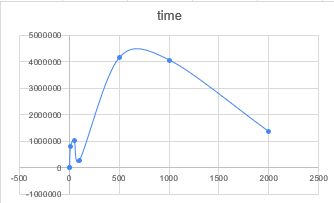
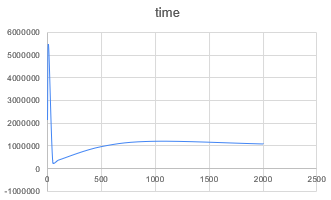

# Assignment 1: Divide-and-Conquer 

This project provides implementations of classic divide-and-conquer algorithms in **Java 17**, with a focus on safe recursion, performance measurement, and validation against theoretical expectations.

## 1. Implementation Overview

The algorithms use standard divide-and-conquer strategies with optimizations to control recursion depth and memory usage:

### MergeSort

* Implements divide-and-conquer with recursion depth approximately **log₂(n)**.
* Uses a **reusable buffer array** to reduce memory allocations.
* Small arrays (`n < 10`) are sorted using **Insertion Sort** for efficiency.

### QuickSort

* Selects the pivot randomly to avoid worst-case behavior.
* Recurses on the **smaller partition first** to limit stack depth.
* Recursion depth is typically bounded by **2·log₂(n)** on average.

### Deterministic Select (Median-of-Medians)

* Groups elements in sets of 5 to compute the pivot.
* Recurses only into the partition containing the **k-th element**.
* Recursion depth is roughly **log₂(n)**.

### Closest Pair of Points

* Divides points based on **x-coordinates**.
* The strip check examines **up to 7 neighboring points** to find the closest pair.
* Recursion depth is approximately **log₂(n)**.

## 2. Recurrence and Complexity Analysis

| Algorithm            | Recurrence                       | Complexity                            | Notes                                                               |
| -------------------- | -------------------------------- | ------------------------------------- | ------------------------------------------------------------------- |
| MergeSort            | T(n) = 2T(n/2) + Θ(n)            | Θ(n log n)                            | Recursion depth ≈ log₂(n); execution time matches theory            |
| QuickSort            | T(n) = T(U) + T(n-U-1) + Θ(n)    | Expected Θ(n log n), Worst-case Θ(n²) | Randomized pivot, recursion on smaller partition, depth ≤ 2·log₂(n) |
| Deterministic Select | T(n) = T(n/5) + T(≤7n/10) + Θ(n) | Θ(n)                                  | Median-of-Medians pivot, recursion into k-th element only           |
| Closest Pair (2D)    | T(n) = 2T(n/2) + Θ(n)            | Θ(n log n)                            | Strip check adds a constant factor, depth ≈ log₂(n)                 |

## 3. Performance Visualization

Graphs in the project illustrate how execution time and recursion depth vary with input size, providing insight into the efficiency and behavior of each algorithm.
 
Merge Sort
---
Time vs n

Recursion Depth vs n

QuickSort
---
Time vs n

Recursion Depth vs n

DetermenisticSelect
---
Time vs n

Recursion Depth vs n

ClosestPair
---
Time vs n

Recursion Depth vs n

## 4. GitHub Workflow

### Branches

* `main`: Stable, working versions.
* `feature/mergesort`: Implements MergeSort.
* `feature/quicksort`: Implements QuickSort.
* `feature/select`: Implements Deterministic Select.
* `feature/closest`: Implements Closest Pair of Points.

### Commit Structure

* `init`: Project setup (Maven, JUnit 5, CI).
* `feat(metrics)`: Performance metrics (time, recursion depth, comparisons, memory).
* `feat(mergesort)`: MergeSort with reusable buffer and small-array cutoff.
* `feat(quicksort)`: QuickSort with randomized pivot.
* `feat(select)`: Deterministic Select using Median-of-Medians.
* `feat(closest)`: Closest Pair of Points using divide-and-conquer.
* `fix`: Bug fixes for edge cases, duplicates, and small arrays.
* `release`: Final stable version (v1.0).

### Testing

* **Correctness**: Each algorithm is verified against known solutions (e.g., Select compared to `Arrays.sort(a)[k]`).
* **Performance**: Recursion depth and execution time are measured to ensure alignment with theoretical complexity.

